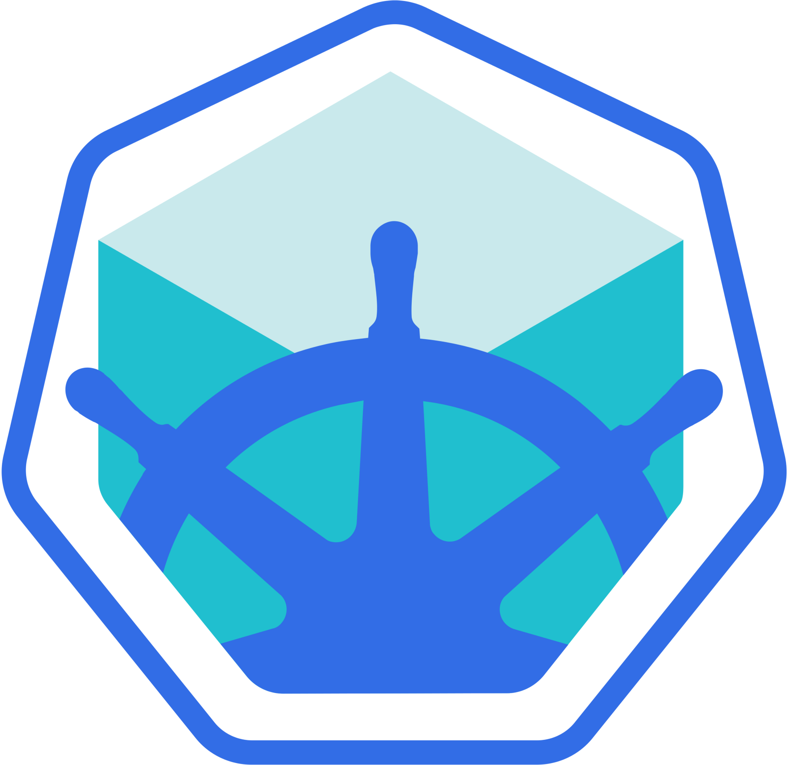

## Kubernetes Deep Dive

{style="border:none"}

## Who are we?

## Vlad

{height=300px style="border:none"}

Developer

{width=150px vertical-align=middle style="border:none "}

## Hannes

{height=300px style="border:none"}

Sysadmin

{width=150px  style="border:none;vertical-align=middle"}

# Kubernetes

# "Container Orchestrator"

## Docker

One Container

::: notes
does everyone know docker?
independent containers
:::

## Docker Compose

Multiple Containers

One Machine

::: notes
swarm
:::

## Kubernetes

Multiple Containers

Multiple Machines


# History

## Borg @ Google

* \>100k containers
* \>1k of machines

→ Massive Scale

## Kubernetes

* Based on Borg
* 2015: v1.0 released
* Written in Go

::: notes
* young (3 years)
* rewrite
* concepts from borg
:::

## Kubernetes

* Active GitHub Repository
* Awesome Community

::: notes
* \>35k stars
* most comments (400k)

* Google Employees work on k8s
* Slack Channel
* Regular Community Meetings
:::

# How does Kubernetes work?

::: notes
* part1: internals
* part2: resources, how to use it
:::

# Internals

## Internals

{style="border:none"}

## Master

* Scheduling
* API

## Node

* "kubelet"
* Docker or rkt
* Proxy

## Node

* Logging
* Monitoring
* Add-ons

::: notes
* DNS
:::

## etcd

* Key-Value Store
* Stores State

::: notes
everything else stateless
:::

## Networking

* SDN daemon
* no NAT

::: notes
on each node

* calico
* flanneld

kube-proxy forwards

node agnostic
:::

# Interface

## Interface

* HTTP REST API
* Auth Tokens

→ kubectl

## Interface

* create/read/update/delete resources
* Get Logs
* Forward Ports
* "exec" into container

::: notes
similar to docker command line
:::

## Interface

imperative approach

```sh
kubectl run nginx --image nginx
kubectl expose service nginx --port 80 my-service
```

## Interface

declarative approach (YAML)

```sh
kubectl apply -f state.yml
```

# Resources

## Pods

* Multiple containers
* Share network namespace
* Ephemeral

::: notes
* atomic unit
:::

## Pods

```yaml
  apiVersion: v1
  kind: Pod
  metadata:
    name: nginx
  spec:
    containers:
    - name: nginx
      image: nginx:1.7.9
      ports:
      - containerPort: 80
```

::: notes
* similar to docker-compose
* except network
:::

## Pods

```yaml
→ apiVersion: v1
  kind: Pod
  metadata:
    name: nginx
  spec:
    containers:
    - name: nginx
      image: nginx:1.7.9
      ports:
      - containerPort: 80
```

::: notes
* backwards compatibility
* third-party integrations
:::

## Pods

```yaml
  apiVersion: v1
→ kind: Pod
  metadata:
    name: nginx
  spec:
    containers:
    - name: nginx
      image: nginx:1.7.9
      ports:
      - containerPort: 80
```

## Pods

```yaml
  apiVersion: v1
  kind: Pod
→ metadata:
    name: nginx
  spec:
    containers:
    - name: nginx
      image: nginx:1.7.9
      ports:
      - containerPort: 80
```

::: notes
* name
* labels
:::

## Pods

```yaml
  apiVersion: v1
  kind: Pod
  metadata:
    name: nginx
→ spec:
    containers:
    - name: nginx
      image: nginx:1.7.9
      ports:
      - containerPort: 80
```

## Pods

```yaml
  apiVersion: v1
  kind: Pod
  metadata:
    name: nginx
  spec:
    containers:
→   - name: nginx
      image: nginx:1.7.9
      ports:
      - containerPort: 80
```

::: notes
* image tag
* pull policy
:::

## Pods

```yaml
  apiVersion: v1
  kind: Pod
  metadata:
    name: nginx
  spec:
    containers:
    - name: nginx
      image: nginx:1.7.9
→     ports:
      - containerPort: 80
```

::: notes
* docker: EXPOSE
:::

## Deployment

::: notes
problem: scale pods
:::

## Deployment

* Controls many identical Pods
* Handles container updates

## Deployment

```yaml
  apiVersion: apps/v1
  kind: Deployment
  metadata:
    name: nginx-deployment
    labels:
      app: nginx
  spec:
    [...]
```

## Deployment

```yaml
  apiVersion: apps/v1
  kind: Deployment
  metadata:
    name: nginx-deployment
→   labels:
      app: nginx
  spec:
    [...]
```

::: notes
labels

free form key-value

match on labels
:::

## Deployment

```yaml
  spec:
    replicas: 3
    strategy: RollingUpdate
    selector:
      matchLabels:
        app: nginx
    template:
      metadata:
        labels:
          app: nginx
      spec:
        containers:
        - name: nginx
          image: nginx:1.7.9
```

## Deployment

```yaml
  spec:
→   replicas: 3
    strategy: RollingUpdate
    selector:
      matchLabels:
        app: nginx
    template:
      metadata:
        labels:
          app: nginx
      spec:
        containers:
        - name: nginx
          image: nginx:1.7.9
```

## Deployment

```yaml
  spec:
    replicas: 3
→   strategy: RollingUpdate
    selector:
      matchLabels:
        app: nginx
    template:
      metadata:
        labels:
          app: nginx
      spec:
        containers:
        - name: nginx
          image: nginx:1.7.9
```

::: notes
* rolling-update
* recreate
:::

## Deployment

```yaml
  spec:
    replicas: 3
    strategy: RollingUpdate
→   selector:
      matchLabels:
        app: nginx
    template:
      metadata:
        labels:
          app: nginx
      spec:
        containers:
        - name: nginx
          image: nginx:1.7.9
```

::: notes
has to match pods
:::

## Deployment

```yaml
  spec:
    replicas: 3
    strategy: RollingUpdate
    selector:
      matchLabels:
        app: nginx
→   template:
      metadata:
        labels:
          app: nginx
      spec:
        containers:
        - name: nginx
          image: nginx:1.7.9
```

## Deployment

```yaml
  spec:
    replicas: 3
    strategy: RollingUpdate
    selector:
      matchLabels:
        app: nginx
    template:
      metadata:
        labels:
          app: nginx
→     spec:
        containers:
        - name: nginx
          image: nginx:1.7.9
```

::: notes
same as pod
:::

## Service

::: notes
problem: how to reach pods
:::

## Service

* Static Endpoint
* Forwards Traffic to Pods

## Service

```yaml
  apiVersion: v1
  kind: Service
  metadata:
    name: my-service
  spec:
    selector:
      app: nginx
    ports:
    - protocol: TCP
      port: 80
      targetPort: 1234
```

## Service

```yaml
  apiVersion: v1
  kind: Service
  metadata:
    name: my-service
  spec:
→   selector:
      app: nginx
    ports:
    - protocol: TCP
      port: 80
      targetPort: 1235
```

## Service

```yaml
  apiVersion: v1
  kind: Service
  metadata:
    name: my-service
  spec:
    selector:
      app: nginx
→   ports:
    - protocol: TCP
      port: 80
      targetPort: 1234
```

## Ingress

::: notes
services are cluster-internal

problem: make services available to the outside
:::

## Ingress

* Makes Services available outside the Cluster
* Routing of Requests

## Ingress

* Cloud Load Balancers (AWS, GCE)
* Local IP

## Ingress

```yaml
  apiVersion: extensions/v1beta1
  kind: Ingress
  metadata:
    name: my-ingress
  spec:
    rules:
    - http:
        paths:
        - path: /
          backend:
            serviceName: my-service
            servicePort: 80
```

## Ingress

```yaml
  apiVersion: extensions/v1beta1
  kind: Ingress
  metadata:
    name: my-ingress
  spec:
→   rules:
    - http:
        paths:
        - path: /
          backend:
            serviceName: my-service
            servicePort: 80
```

## Ingress

```yaml
  apiVersion: extensions/v1beta1
  kind: Ingress
  metadata:
    name: my-ingress
  spec:
    rules:
    - http:
        paths:
        - path: /
→         backend:
            serviceName: my-service
            servicePort: 80
```

# Ecosystem

## Hosted K8S

* GKE
* EKS
* Fargate
* DigitalOcean

::: notes
* Google Kubernetes Engine
* Elastic Container Service
:::

## Setting up your own cluster

## kops

* Provider agnostic
* AWS
* GCE

## kubeadm

* Toolkit to bootstrap k8s Cluster
* Beta

## kubespray

* Ansible playbook

## rancher

{style="border:none"}

::: notes
* had cattle
* with 2.0 -> kubernetes
:::

## OpenShift

{style="border:none"}

RedHat

## Tectonic

{style="border:none"}

CoreOS

## minikube

{height=400px style="border:none"}

## Deploying applications

## helm

{height=400px style="border:none"}

## ksonnet

{height=400px style="border:none"}

## kompose

{height=400px style="border:none"}

## Cool stuff

## OpenFaaS

FaaS Platform on top of K8s

## virtlet

VMs instead of Containers!

## Competitors

* Docker Swarm
* Apache Mesos + Marthon
* Hashicorp Nomad

# Example
