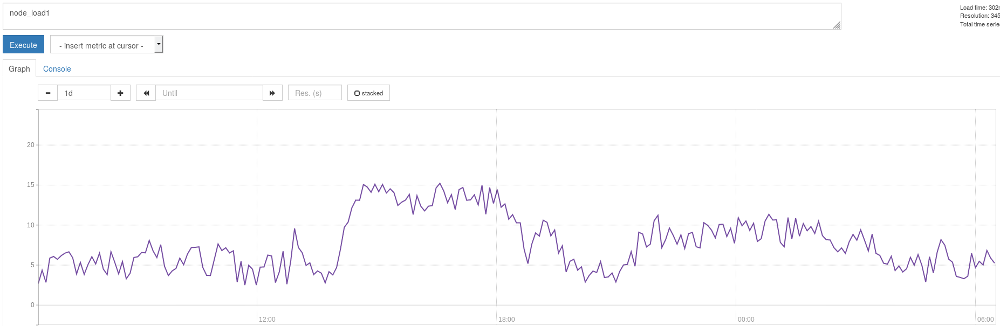
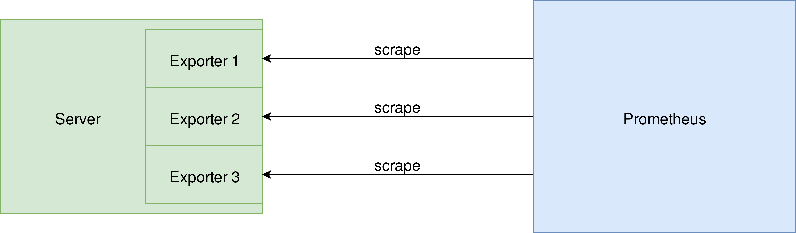
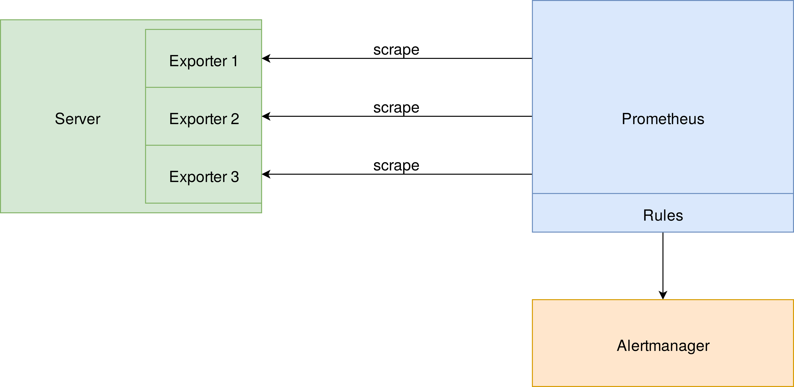

## Me

{height=300px style="border:none"}

Sysadmin @ Tradebyte

{width=150px  style="border:none;vertical-align=middle"}

## Agenda

1. What is it?
2. Who built it?
3. How does it work?
4. Usage at Tradebyte

## Prometheus

* Simple data model
* Very powerful, flexible

## Prometheus

* by SoundCloud
* similar to Google's borgmon
* no independent open source project
* CNCF

## Metrics

```
http_requets_total 514.0
```

::: notes
always a float
:::

## Metrics

```
http_requets_total{response="200"} 514.0
```

> * always a float
> * export via HTTP

::: notes
counters or gauges
:::

## Exporters

* Listen of HTTP requests
* Return metrics

## Node exporter

```
...
node_load1 0.68
node_load5 1.14
node_load15 1.42
node_memory_MemFree_bytes 5.730304e+08
node_memory_MemTotal_bytes 3.381096448e+10
node_network_receive_bytes_total{device="eth0"} 8.0238013e+12
node_network_receive_errs_total{device="eth0"} 0
...
```

## MySQL

```
...
mysql_up 1
mysql_slave_status_seconds_behind_master 0
mysql_slave_status_slave_sql_running 1
mysql_slave_status_slave_io_running 1
...
```

## Exporters

* PostgreSQL
* ElasticSearch
* IPMI
* RabbitMQ
* Ceph
* Apache
* Nginx
* Traefik
* Docker
* GitHub
* Kubernetes
* ...

## Write your own exporter!

## Python

```py
import prometheus_client as prom

class MyCollector(object):
    def collect():
        metric = prom.core.GaugeMetricFamily('my_metric')
        metric.add_metric(value=5)
        yield metric

if __name__ == '__main__':
	prom.REGISTRY.register(MyCollector())
	prom.start_http_server(8000)
	while True: time.sleep(1)
```

## Python

```shell
curl http://localhost:8000/metrics

my_metric 5
```

## Make your application export metrics

* Go
* Python/Django
* Node.js
* Clojure
* Java

## Python

```py
def long_running_function():
    do_compute()
```

## Python

```py
from prometheus_client import Summary
compute_time = Summary('compute_time')

@compute.time.time()
def long_running_function():
    do_compute()
```

```
compute_time_count
compute_time_sum
```

## What to do with metrics?

{style="border:none;vertical-align=middle"}

also, Grafana

## What to do with metrics?

```yaml
alert: InternalServerErrorResponses
expr: http_requets_total{response="500"} > 10
annotations:
  summary: "Too many 500 errors"
```

## Alertmanager

* alert batching
* alert routing

* Mail, OpsGenie, PagerDuty, Slack

## Architecture

{style="box-shadow:none;border:none;vertical-align=middle"}

## Architecture

{style="box-shadow:none;border:none;vertical-align=middle"}

## All-in-one Solution

* Infrastructure
* Application

→ Easy correlation

## Architecture

Target discovery

* Kubernetes / Marathon / OpenStack
* AWS / GCE / Azure

## Architecture

Backing Storage

* InfluxDB
* PostgreSQL/TimescaleDB

## Experience

* Easy setup
* Steep learning curve
* Similar model to Check_MK
